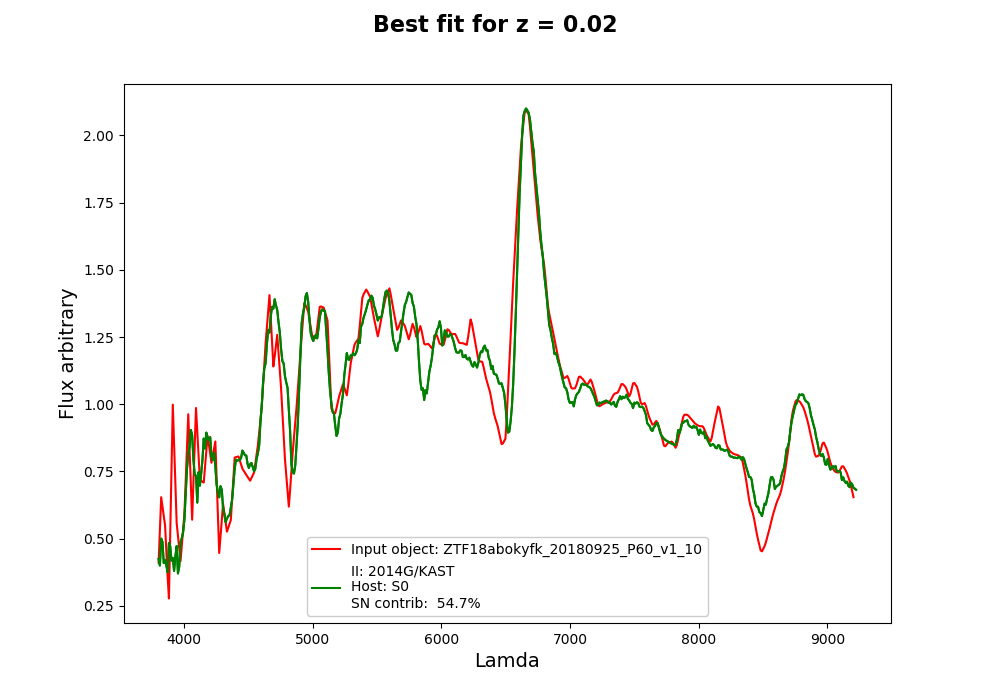

# superfit

Spectral classification of supernovae. `superfit` fits an observed spectrum
against a bank of supernova and host-galaxy templates over a grid of
redshift and extinction, and ranks the matches by chi2.

Formerly published as **NGSF** (Next Generation SuperFit). `import NGSF`
still works and warns; new code should use `superfit`.

## Install

```bash
pip install superfit
```

Then fetch the template bank, which is a 74 MB download and is deliberately
not bundled:

```bash
curl -LO https://www.wiserep.org/sites/default/files/supyfit_bank.zip
unzip supyfit_bank.zip          # creates ./bank
```

`superfit` looks for the bank in `$SUPERFIT_BANK_DIR`, then `./bank`, then
next to the installed package. If it cannot find one it says so and lists
where it looked.

## Quick start

Fitting arrays you already have in memory — nothing has to touch disk:

```python
from superfit import Superfit

results = Superfit(wavelength=lam, flux=flux, error=err, z=0.127).run()
print(results[["SN", "GALAXY", "A_v", "CHI2/dof"]].head())
```

`results` is a pandas DataFrame, best match first.

From a file instead:

```python
from superfit import Spectrum, Superfit

spectrum = Spectrum.from_file("SN2021urb.flm")
results = Superfit(spectrum, z=0.127).run()
```

A `Spectrum` is reusable, so scanning a few redshifts costs one read:

```python
for z in (0.12, 0.127, 0.13):
    print(z, Superfit(spectrum, z=z).run()["CHI2/dof"].iloc[0])
```

Or from the command line, with a JSON parameter file:

```bash
superfit parameters.json
superfit parameters.json --object spectrum.flm --out results/ --no-plots
superfit parameters.json --resolution 30 --n-cores 16
```

## Supplying the spectrum

`Superfit` takes the observation in whichever form you have it:

```python
Superfit(wavelength=lam, flux=flux, error=err)   # arrays
Superfit(Spectrum.from_file("spec.flm"))          # a Spectrum
Superfit("spec.flm")                              # a path
Superfit(numpy_array)                             # (n, 2) or (n, 3)
```

`error` is optional. It is only *required* for
`error_spectrum="included"`; otherwise the uncertainty is estimated from
the spectrum itself (see below).

`Spectrum` sorts descending wavelengths rather than complaining, and
refuses input that cannot be a spectrum — mismatched lengths, duplicate
wavelengths, all-NaN flux — naming the problem.

## Configuring the fit

Every setting has a default, so pass only what you care about. Settings can
come as keywords, as a dict, as a JSON string, or as a path to a JSON file:

```python
Superfit(spectrum, z=0.127, resolution=30)
Superfit(spectrum, config={"resolution": 30, "minimum_overlap": 0.5})
Superfit(spectrum, config="parameters.json", z=0.127)   # file, one override
```

Some shorthand is accepted: `z` (implies an exact redshift rather than a
scan), `output_dir`, `n_plots`, `error_model`, `cores`.

Unknown keys are rejected rather than ignored, and combinations that cannot
work — masking host lines while scanning redshift, a negative resolution, an
inverted A_v range — are caught up front instead of failing inside a worker
process partway through a run.

Whatever you pass, the *complete* effective configuration is written to
`<name>_used.json` next to the results, so a three-keyword call is as
reproducible as a full JSON one. See `superfit.config.DEFAULT_CONFIG` for
the defaults, and the parameter reference below for what each key means.

## Requirements

Python 3.9+, with numpy, scipy, astropy, pandas, matplotlib, extinction,
PyAstronomy and tqdm. `pip install superfit` handles these.

Optional: `pip install superfit[speed]` adds `threadpoolctl`, which stops
worker processes contending over BLAS threads. Without it the fit is
correct, just slower.

Tested on both an older stack (numpy 1.24, scipy 1.8, astropy 5.2, pandas
1.5) and a current one (numpy 2.5, scipy 1.18, astropy 8.0, pandas 3.0),
producing byte-identical results on either.

### Building an environment from source

A self-contained virtualenv, which keeps the dependencies out of your user
site-packages (`~/.local`) where they can collide with other projects:

```bash
python -m venv /path/to/envs/superfit        # NOT --system-site-packages
source /path/to/envs/superfit/bin/activate
pip install -e ".[dev]"
```

Building *without* `--system-site-packages` is deliberate. A venv that
inherits the system packages also picks up `~/.local`, and a stale package
there shadows the system one — the usual symptom is an import error from
inside matplotlib that has nothing to do with your code.

### On NERSC (Perlmutter)

An environment built this way lives at

```
/global/cfs/cdirs/desicollab/users/xhall/envs/superfit
```

Activate and go, from any working directory:

```bash
source /global/cfs/cdirs/desicollab/users/xhall/envs/superfit/bin/activate
superfit /path/to/parameters.json
```

It is an editable install of the checkout at
`/global/cfs/cdirs/desicollab/users/xhall/GitHub/superfit`, so the template
bank is found automatically and `git pull` takes effect without
reinstalling. Moving or renaming that checkout breaks the link; re-run
`pip install -e .` if you do.

## Tests

```bash
pytest                      # everything, ~30s
pytest -m "not endtoend"    # skip the tests that need the template bank
```

Six groups:

- `test_core_kernel.py` pins the fitting linear algebra against an
  independent loop-based reference, so optimisation work can be checked
  against something other than itself.
- `test_robustness.py` drives extreme inputs — cosmic rays, NaN gaps,
  interpolated-flat stretches, spectra straddling zero — through the error
  and binning routines.
- `test_spectrum.py` and `test_config.py` cover the input handling.
- `test_api.py` fits the same data as a file, as arrays, as a `Spectrum`
  and as a raw array, and asserts the four agree.
- `test_regression.py` runs the real pipeline over the real bank and
  compares against a committed golden result, separating "which template
  won and in what order" from "what were the numbers".

If you change the science on purpose, regenerate the golden file in the same
commit and say why:

```bash
python superfit/tests/test_regression.py --regenerate
```

## Building a release

```bash
python -m build
python -m twine check dist/*
```

The template bank must never end up in the sdist; CI greps for it and fails
the build if it does.

## The parameters of the fit

Every key below can be set in a JSON file, in a dict, or as a keyword to
`Superfit`, and every one has a default. A full parameters.json looks like
this (the example spectrum is included in the repository):


    "object_to_fit" : "SN2021urb_2021-08-06_00-00-00_Keck1_LRIS_TNS.flm",

    "use_exact_z": 1,
    "z_exact": 0.127,


    "z_range_begin": 0,
    "z_range_end": 0.13,
    "z_int": 0.01,


    "resolution":10,

    "temp_sn_tr"  : ["IIb-flash", "computed", "Ia 02es-like", "Ia-02cx like", "TDE He", "Ca-Ia",
                    "Ia-CSM-(ambigious)", "II", "super_chandra", "SLSN-II", "IIn", "FBOT", "Ibn",
                    "SLSN-IIn", "Ia 91T-like", "IIb", "TDE H", "SN - Imposter", "II-flash", "ILRT",
                    "Ia 99aa-like", "Ic", "SLSN-I", "Ia-pec", "Ib", "Ia-CSM", "Ia-norm", "SLSN-Ib",
                    "TDE H+He", "Ia 91bg-like", "Ca-Ib", "Ia-rapid", "Ic-BL", "Ic-pec", "SLSN-IIb"],

    "temp_gal_tr" : ["E","S0","Sa","Sb","SB1","SB2","SB3","SB4","SB5","SB6","Sc"],

    "lower_lam": 0,
    "upper_lam": 0,

    "error_spectrum" : "sg",
    "saving_results_path" : "",

    "show_plot" : 1,
    "how_many_plots" : 1,

    "mask_galaxy_lines":1,
    "mask_telluric":0,

    "minimum_overlap": 0.7,

    "epoch_high": 0,
    "epoch_low" : 0,

    "Alam_high": 2,
    "Alam_low": -2,
    "Alam_interval":0.2


`"object_to_fit"` : the object to analyze, should be located within the superfit folder.

`"use_exact_z"`: can be 1 (yes) or 0 (no). Determines wether the redshift will be an exact number or an array.

`"z_exact"`    : exact redshift value that will be used if `"use_exact_z"` = 1

`"z_range_begin"`,`"z_range_end"`,`"z_int"`: redshift values from which to build an array over which to look for the best fit.

`"resolution"`: the nominal resolution of the fit in Angstroms, default 10. The fit itself runs on a grid uniform in ln(lambda) (see below), so this is used to choose that grid's step unless `velocity_resolution` says otherwise.

`"velocity_resolution"`: the step of the fitting grid, in km/s. Leave it unset and it is derived from `resolution` so the log grid holds as many bins as a linear grid of that many Angstroms would have over the same span -- about 500 km/s for the usual 10 A across the optical.

`"temp_gal_tr"`, `"temp_sn_tr"`: template library folders over which to look in order to find the fit. It is recommended that the user uses the full library as is.

`"lower_lam"`: Lower bound for wavelength over which to perform the fit
`"upper_lam"`: Upper bound for wavelength over which to perform the fit, if this is equal to `"lower_lam"` then the wavelength range will be chosen automatically as that of the object to fit ± 300Å

`"error_spectrum"` : refers to the type of routine used to perform the calculation of the error spectrum. The recommended one is `sg` Savitzky-Golay, there is also the option of `linear` estimation and the option `included` in which the user can use the error spectrum that comes with an object if he wants to, however, this is not recommended.

`"saving_results_path"`: path in which to save the performed fits, the default one is the superfit folder.

`"show_plot"` : to show the plotted fit or no, the default being 1, to show.
`"how_many_plots"`: number of plots to show if the user wants to show, if the `"show"` is zero then `"n"` has no effect.

`"mask_galaxy_lines"` : Either 1 or 0, masks the galaxy lines for both the template bank and the object of interest. For this option to work the redshift must be one defined values and not at array of values, meaning `"z_int"` must be equal to zero and `"z_start"` must be the redshift of choice.
`"mask_telluric"`: Either 1 or 0, masks the flux within the wavelength range from 7594 to 7680 in the observer's frame.

`"minimum_overlap"`: minimum percentage overlap between the template and the object of interest. Recommendation is for this to stay near 0.7

`"epoch_high"`: Upper bound epoch for phase truncation. If this equals the `"epoch_low"` parameter then there is not phase truncation.
`"epoch_low"`: Lower bound epoch for phase truncation.

`"Alam_high"`: High value for the extinction law constant
`"Alam_low"`: Lower value for the extinction law constant
`"Alam_interval"`: size of interval

A_v is the CCM89 extinction in magnitudes at V, applied to the supernova
template at its **rest** wavelength — so it models host-galaxy dust, and any
Milky Way component is absorbed into the same single term. Negative A_v is not
physical extinction; it is kept in the default grid as slack for a template
redder than the object, and so that a best fit at zero extinction is an
interior point rather than a grid edge.


### Optional parameters

These all have defaults and can be left out of the JSON entirely.

`"R_v"`: total-to-selective extinction ratio for the CCM89 law. Defaults to
`3.1`, the diffuse Milky Way average. Lower it for denser sightlines.

`"n_cores"`: worker processes for the (redshift, A_v) grid. `0` or absent
means "use the CPUs this process is allowed on", capped at 32 — past that,
process startup costs more than the extra parallelism returns. The pool is
never larger than the number of grid points.

`"iterations"`: how many templates each grid point contributes to the result
table. Default 10. Raise it if the final list is shorter than you want; the
table is deduplicated by SN, so many grid points agreeing on the same
template yields few rows.

`"weighted_solve"`: `0` (default) or `1`. See "A note on the weighting"
below. Off by default so results reproduce; turning it on changes them.

### A note on the weighting

The supernova and galaxy amplitudes are solved by minimising the
**unweighted** residual, while the chi2 that ranks the templates is weighted
by the error spectrum. The reported chi2 is therefore not the minimum of the
reported model. Setting `"weighted_solve": 1` carries `1/sigma^2` into the
solve as well, which on the bundled test spectrum lowers chi2 by a median
20% and reorders the tail of the results (the top match is unchanged there,
but it need not be in general).

This is left off by default so that existing results reproduce. If you are
starting fresh, `1` is the statistically consistent choice.

### Warnings you should not ignore

The run prints a warning when a best-fit `A_v` or `Z` lands on the first or
last value of the grid it was allowed to search, for example:

    WARNING: rank 1: best-fit A_v = -2 sits on the lower edge of the searched
    grid [-2, 2]; the true optimum is probably outside it, so widen the range
    before trusting this value

A parameter pinned to the edge of its range is a boundary artefact, not a
measurement. Widen `Alam_low`/`Alam_high` (or the redshift range) and refit.


# Further details about the code


## New template bank

The superfit template bank contains major subclasses such as: calcium rich supernovae, type II flashers, TDEs, SLSN-I and II, among others, separated in different folders for more accurate classification. The default option for binning in 10A.
The user must make sure to have this template bank or some alternative template bank of his own in order to run superfit, and please be mindful that superfit is only as good as the template bank it uses.


The user has the option to create a bank with masked lines, meaning to mask host galaxy lines that could be in the templates, this option is default to False. If the user is interested in seeing which lines are being masked he can access the `mask_lines_bank` function within the `superfit/Header_Binnings.py` file.

It is important to note that when you open the folder of the bank there are two main subfolders, one named "original_resolution" and one named "binnings".
The "original_resolution" folder contains the raw spectra from the bank, with the wavelengths in observed frame. In the "binnings" folder we have the binned and redshift-corrected spectra from the "original_resolution" folder, and so the fits are done using the "binnings" folder.
Within the object subfolders inside the "original_resolution" folder we will find the wiserep files containing the metadata for each object (name,redshift, observational date, etc.) we use this metadata during the fit, and so we keep the folder.


## Why the fit runs in log wavelength

The fitting grid is uniform in `ln(lambda)`, not in Angstroms, because a
redshift is then a *translation*:

    ln(lambda_obs) = ln(lambda_rest) + ln(1 + z)

The displacement is the same for every template and every wavelength, so the
bank is resampled once onto a rest-frame log grid and each trial redshift is
two array slices and a linear blend across the whole bank at once. On a
linear grid every template had to be interpolated onto the observed axis
again at every trial redshift -- about a thousand `np.interp` calls per grid
point.

A consequence worth knowing: the grid is uniform in velocity, so its width in
Angstroms grows with wavelength. At 500 km/s a bin is 8 A at 5000 A and 15 A
at 9000 A, where a linear 10 A grid was 10 A everywhere. The blue end is
sampled more finely and the red end less.

Shifting also resamples twice -- once onto the rest grid, once for the shift
-- so structure finer than a bin is averaged rather than reproduced. For
resolved features the two agree to about 1 part in 10^3; for noise at the
sampling scale it is a smoothing.

## How a fit is put together

`Superfit.run()` prepares the observation and then hands it to
`all_parameter_space`, which evaluates every (redshift, A_v) grid point
across a process pool. Within a grid point, `solve_grid` fits every
(galaxy, supernova) pair at once as a set of matrix products and scores each
with chi2 — that is where nearly all the time goes.

Roughly:

```
Spectrum  ──▶  mask host lines / telluric  ──▶  normalise  ──▶  int_obj
    │                                                             │
    └──▶  bin to `resolution`  ──▶  error model  ──▶  sigma       │
                                                        │         │
                          all_parameter_space  ◀────────┴─────────┘
                                    │
                    for each (z, A_v):  solve_grid  ──▶  top `iterations`
                                    │
                          rank, dedupe by SN, write CSV
```

The quantities involved:

- `int_obj`: interpolated object to fit
- `redshift:` Can be an array or an individual number. These are the redshift values over which to optimize.
- `extconstant`: Array of values over which to optimize for the extinction constant. The user does not change this.
- `templates_sn_trunc:`  Truncated library of supernovae, aka: which SN types to look at when optimizing.
- `templates_gal_trunc:` Truncated library of host galaxies, aka: which HG types to look at when optimizing.
- `lam:` Lambda array over which to perform the fit. The default is from 3000 A to 10500 A.
- `resolution:` Resolution at which to bin and perform the fit. The default is 10 A.
- `kind:` Corresponds to the type of error spectrum the user prefers, the options are `SG`:Savitsky Golay, `linear`: for obtaining the error of the spectrum
by making linear fit every 10 points, and `included`: if the user wants to use the error that comes with the object itself. The default is `sg`
- `save:` Name of results file
- `minimum_overlap:` Corresponds to minimum percentage overlap between the template and the object of interest


# Results

The results are: an astropy table that is saved as a csv file, and the best fit plots saved as pdf files (they both save to the superfit folder or to the specified `saving_results_path`)


## The output graphs look like this





The plot shows the input object in red, the SN and Host Galaxy combined templates in green. The legend shows the SN type, HG type and percentage contribution from the SN template to the fit. On top of the plot the redshift value is indicated.
